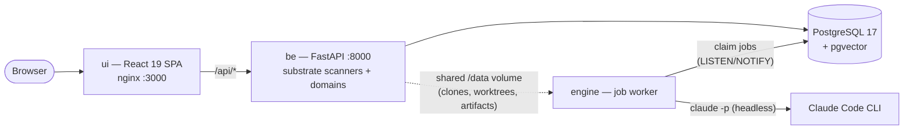

# Shire

[](https://github.com/dardanxh/shire/actions/workflows/ci.yml)
[](./LICENSE)
[](./be/pyproject.toml)
[](./ui/package.json)
[](./CONTRIBUTING.md)

**Shire is a local-first, Claude-powered engineering companion** — a *town* of narrow-domain
expert AI agents (**hobits**) standing on a cross-repo intelligence substrate. It clones and
continuously analyzes your repositories, lets specialized agents watch what matters
(architecture drift, security, dependencies, code health…), and surfaces only what needs your
attention — all running on your own machine.

## What it does

### Workspace

- **Repositories** — ingest any git repo and get a living scorecard: lines of code &
  complexity (scc, lizard, radon), SBOM & vulnerabilities (syft, osv-scanner), leaked secrets
  (gitleaks), OSSF Scorecard, dead code, git history & ownership. The detail view goes deep:
  **Ask** (free-form Q&A answered by an agent exploring the actual code), Claude-written
  architecture / tech-stack / overview artifacts, branches, dependencies, security, and more.
- **Evolution** — every analysis refresh is kept as a snapshot: browse history, see deltas
  between runs, version every Claude artifact, and generate change narratives on demand.
- **Merge reviews** — branch-pair analysis: changes, impact, risk.
- **Members** — one identity per contributor across alias emails, with per-commit analytics
  and ownership insight.

### Intelligence

- **Hobits** — configurable expert agents (built-in roster + your own) that run Claude against
  your clones on a cadence and report findings. Rate their runs and the feedback tunes future
  ones.
- **Briefing** — a tiered "what changed / what needs me" digest across all repos, on the home
  page.
- **Roadmaps** — AI-planned cross-repo roadmaps with executable tickets (worktree → branch).
- **Council** — convene agents with distinct perspectives (including a devil's advocate) to
  debate a topic and converge on a recommendation.
- **Principles** — codified engineering convictions, audited against your code.
- **News** — topic-driven engineering news with repo-context recommendations.

### Apps

Standalone tools for planning, evaluation, and checks:
**AI Readiness** (how ready is a repo for AI-assisted development), **Capacity Planner**
(team capacity & delivery sizing), **Tech Chooser** (weighted side-by-side technology
comparison), **Compliance** (standards checks across repos).

### Knowledge

Curated, starrable reference catalogs — architecture archetypes & blueprints, technologies,
data modelling patterns, security standards, quality attributes. Seeded content plus your own
entries.

### Platform

- **Job engine** — every Claude interaction is a non-blocking job in a Postgres queue with a
  live activity feed, token accounting, and horizontal scale-out.
- **Connectors** — GitHub / GitLab / Bitbucket credentials for private repos and richer
  metadata, encrypted at rest.
- **Visual artifacts** *(optional tools)* — dependency graphs (emerge), code-age charts
  (git-of-theseus), temporal coupling (code-maat), 3D code-city maps (CodeCharta).

## Architecture



- **`be/`** — FastAPI backend: a modular monolith of ~25 feature domains (repository ingest,
  analysis substrate, hobits, roadmaps, council, catalogs…) plus the Postgres-backed job queue.
- **`engine/`** — stateless worker: claims jobs (`FOR UPDATE SKIP LOCKED`), runs them through
  the Claude Code CLI headlessly, streams progress back. Run more instances to scale out.
- **`ui/`** — React 19 + Vite + TanStack Router SPA.
- **`docs/`** — full product vision and decided architecture. Start at
  [`docs/README.md`](./docs/README.md).

## Quickstart (Docker — recommended)

Requirements: [Docker](https://docs.docker.com/get-docker/) with the Compose plugin.

```bash
git clone https://github.com/dardanxh/shire.git
cd shire
./setup.sh
```

That's it. The script generates a `.env` (including the encryption key), builds all images,
starts the stack, and waits for it to be healthy:

- **UI** → http://localhost:3000
- **API docs** → http://localhost:8000/docs

### Claude authentication

Agent features (hobits, ask, merge reviews, roadmaps, council…) run through the
[Claude Code CLI](https://docs.anthropic.com/en/docs/claude-code). `setup.sh` picks up
whichever of these it finds, or you can add one to `.env` later and re-run it:

| Method | How |
| --- | --- |
| **API key** | `export ANTHROPIC_API_KEY=sk-ant-...` before `./setup.sh` (or add it + `USE_API_KEY=true` to `.env`). Billed per token. |
| **Claude subscription (token)** | Run `claude setup-token` on your machine, put the result in `.env` as `CLAUDE_CODE_OAUTH_TOKEN=...`. Uses your Pro/Max subscription. |
| **Claude subscription (mount)** | If `~/.claude` exists, setup.sh mounts it into the engine container. Note: on macOS credentials live in the Keychain, so prefer the token method there. |

Everything else (ingest, scanners, scorecards, catalogs, visualizations) works with no Claude
auth at all.

### Day-2 commands

```bash
docker compose logs -f            # follow all services
docker compose down               # stop (data persists in named volumes)
docker compose down -v            # full reset — deletes DB and cloned repos
docker compose up -d --build      # rebuild after pulling changes
```

## Native development setup

Prefer running services directly? You need: Python 3.13+ with [uv](https://docs.astral.sh/uv/),
Node 20+ with pnpm, Docker (for Postgres only), and the
[Claude Code CLI](https://docs.anthropic.com/en/docs/claude-code) logged in.

```bash
./scripts/setup.sh   # deps + Postgres container + migrations + scanner tools (brew)
./scripts/run.sh     # backend :8000, engine worker, UI dev server :5173
```

The Docker stack and the native stack use separate databases and data directories — they can
coexist but don't share state.

## Tech stack

| Layer | Technology |
| --- | --- |
| Backend | Python 3.13, FastAPI, SQLAlchemy 2, Alembic, Pydantic v2, uv |
| Database | PostgreSQL 17 + pgvector |
| Job engine | Plain psycopg worker, Postgres queue (`SKIP LOCKED` + `LISTEN/NOTIFY`) |
| Agent runtime | Claude Code CLI (`claude -p`, headless, tool-allowlisted) |
| Frontend | React 19, Vite 7, TanStack Router/Query/Table, Tailwind CSS 4, shadcn (Base UI), i18next |
| API contract | OpenAPI → generated TypeScript types (`openapi-typescript` / `openapi-fetch`) |

## Analysis tools

Bundled in the backend image (also installable natively via `scripts/setup.sh`):

| Tool | Purpose |
| --- | --- |
| [scc](https://github.com/boyter/scc) | LOC, complexity, COCOMO estimates |
| [syft](https://github.com/anchore/syft) | SBOM / dependency inventory |
| [osv-scanner](https://github.com/google/osv-scanner) | Known-vulnerability scanning |
| [gitleaks](https://github.com/gitleaks/gitleaks) | Secret detection |
| [scorecard](https://github.com/ossf/scorecard) | OSSF security scorecard |
| ruff · bandit · vulture · lizard · radon | Python lint/security/dead-code/complexity metrics |

Optional visualization tools (installed on demand — see [`docs/external-tools.md`](./docs/external-tools.md)):
[emerge](https://github.com/glato/emerge) (dependency graph),
[git-of-theseus](https://github.com/erikbern/git-of-theseus) (code age),
[code-maat](https://github.com/adamtornhill/code-maat) (temporal coupling),
[CodeCharta](https://github.com/MaibornWolff/codecharta) (3D code map).

## Configuration

The Docker stack is configured through the root `.env` (see [`.env.example`](./.env.example)):

| Variable | Purpose |
| --- | --- |
| `SHIRE_SECRET_KEY` | Fernet key encrypting stored git credentials. Generated by `setup.sh`; **never rotate once in use**. |
| `ANTHROPIC_API_KEY` + `USE_API_KEY=true` | Claude API-key auth for agent jobs. |
| `CLAUDE_CODE_OAUTH_TOKEN` | Claude subscription auth (from `claude setup-token`). |
| `GITHUB_TOKEN` | Optional: richer GitHub metadata, private repos. |
| `CLAUDE_MODEL` | Model alias for agent runs (default `sonnet`). |
| `ENGINE_CONCURRENCY` | Concurrent jobs per engine instance (default 2). |

For native development each service reads its own `.env` — see
[`be/.env.example`](./be/.env.example), [`engine/.env.example`](./engine/.env.example),
[`ui/.env.example`](./ui/.env.example).

## Security model

Shire is **local-first by design**: the API has no authentication and is meant to run on your
own machine or a trusted private network — don't expose ports 3000/8000 to the internet. Stored
git credentials are encrypted at rest with `SHIRE_SECRET_KEY`. See [SECURITY.md](./SECURITY.md).

## Documentation

The [`docs/`](./docs) folder holds the full vision and decided architecture — product surfaces,
the substrate model, hobit anatomy, coordination, domain model, and tool setup. Start at
[`docs/README.md`](./docs/README.md).

## Contributing

Contributions are welcome! See [CONTRIBUTING.md](./CONTRIBUTING.md) for the development
workflow, code conventions, and PR guidelines. All changes land through pull requests; CI
(lint, build, and tests for both `ui/` and `be/`) must pass before merge.

## License

[MIT](./LICENSE) © Dardan Xhymshiti
